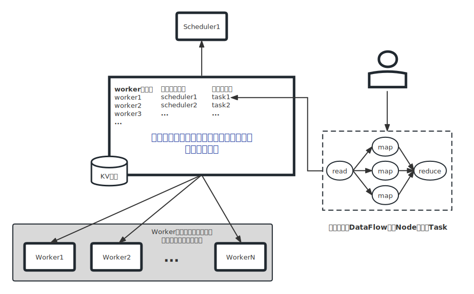
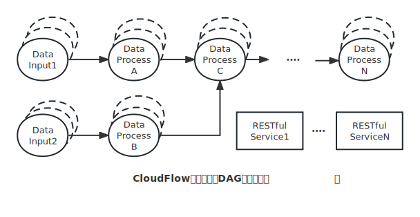

# CloudFlow

#### （一）简介

CloudFlow 利用"编程"的方式尝试解决如下问题：

1. **屏蔽云执行环境**。在当前云原生环境中，应用开发者需要在"编码以外"的事情上投入大量精力。基于CloudFlow编写程序，可在单节点，多节点，以及k8s环境下进行调试，程序员不需要频繁登录到其他节点，不需要知道k8s如何操作。部署时，可以根据目标自动生成Docker镜像以及配置文件，免去配置文件编写过程过程。

2. **数据流编程框架**。CloudFlow是基于DataFlow概念设计的数据处理框架，用户只需要考虑数据如何流动，不需要考虑其执行环境。CloudFlow根据处理数据量的大小以及可用资源情况，自动化的进行调度，实现动态扩缩容。

3. **微服务编程框架**。除去数据流外，CloudFlow 提供 restful apt编程接口，支持多语言（golang, C++, python）混合编程，内置KV存储，对象存储等服务，编程者只用关注业务逻辑，CloudFLow提供统一调试和部署功能。
   
4. **执行流测试框架**。对应传统多阶段，多工具任务（<font color="#0000ff">例如EDA任务需要组合多个小工具进行级联运行</font>），可以通过CloudFlow提供的流构建功能，实现多阶段测试与验证。在流处理模式中，只有当上级节点测试完成，才会执行下一个节点。基于该特征可以实现应用持续集成。

5. **分布式环境构建**。基于k8s环境，CloudFlow中的Node可以按需求被调度到各个物理节点，并且保证节点之间能相互通讯，因此基于该框架可以快速的运行其他框架程序，例如MPI程序、Pytorch/Tensorflow等分布式机器学习框架，以及Ray框架等。

#### （二）逻辑架构

<center><br />
图1 cloudflow 组成
</center><br />

如上图所示，CloudFLow的核心服务有：执行器，全局状态服务，调度器组成

- **执行器：** 执行器（worker）负责从全局状态服务中拉取属于自己的任务进行执行，并实时汇报任务的执行状态，统计信息等。
- **调度器：** 调度器（scheduler）负责进行任务调度，把用户提交的任务指派给最适合的执行器。并对全局状态进行维护，例如清空超时任务，检查任务状态等。
- **状态服务：** 用来保存整个cloudflow的全局信息，例如任务执行状态，worker和scheduler信息等。
- **任务：** 在CloudFlow中，一个应用（Job）由多个Task组织，Job对应应用中的整个DAG图，Task对应其中的每个节点。
- **消息通讯：** worker之间通过消息中间件进行数据传递，目前支持 Jet-Stream，后继计划支持 Rocket-MQ等

#### （三）基本概念

在使用Cloudflow进行开发时，需要理清楚如下基本概念：

1. **APP：** 应用主体，表示应用本身，是"服务"的集合。
2. **Session：** 会话，当应用支持"常驻"时，一个Session表示一次用户任务执行（仅仅在APP Reuse模型下有多个session），Session内的Flow，Node等可资源相互可见，在同一命名空间中。一个APP下可以有多个Session。
3. **Flow：** 控制流，应用的数据流程逻辑。属于Session，一个Session下可以有多个Flow。
4. **Node：** 控制流的基本组成单元，一个Node代表一个进程。通常情况下，一个Node独立运行一个物理节点或者docker。
5. **Service：** 控制服务，用于实现rest ful API 或者 RPC，共享APP命名空间内数据。

各组件层级关系如下：

```
APP
  +Session
   +Flow
    +Node
  +Service
```

其中 Node 和 Service 是基础调度单元，可以进行相互访问。

<center><br/>图 2 cloudflow 应用
</center>

在CloudFlow应用中，节点和服务之间通过消息进行通讯。每个Node和Service可以有多个实例。如图2所示，Node构成的DAG图主要用于数据流处理，Service针对微服务应用。

#### （四）使用案例

"词频统计"是最常见的数据流程处理任务，统计文件/字符串中词语出现的次数。示例编码如下：

```
package main

import (
	cf "cloudflow/sdk/golang/cloudflow"
)

func statistics(app *cf.App) string {
	return "Hello word"
}

func ReadWords(self *cf.Node, count int) string {
	// ...
}

func CountWords(self *cf.Node, txt string) map[string]float64 {
	// ...
}

func ReduceWords(se *cf.Node, statistic []map[string]float64) map[string]float64 {
	// ...
}

func main() {
	var app = cf.NewApp("test-app")
	var ses = app.CreateSession("session-1")
	var flw = ses.CreateFlow("flow-1")
	app.Reg(statistics, "record the process")
	flw.Add(ReadWords, "read", 10_0000).Map(CountWords, "count", 10).Reduce(ReduceWords, "reduce", 10)
	app.Run()
}
```

先定义数据产生，处理函数，如果通过CloudFlow接口构建Flow，然后执行。执行过程中CloudFlow会根据参数选择是单节点，多节点还是基于K8s环境执行。对于用户而言，感觉是在本地执行。

#### （五）快速开始

**1. 安装&运行**
```
# 安装 etcd 
请参考 https://etcd.io/docs/v3.5/install/

# 安装 jet stream
请参考 https://nats.io/download/

# 启动前置服务
bash script/startsrvs.bash

# 执行用例
bash script/reinitall.bash; bash script/cloudflow.bash -d example gigasort

```

2. 验证 TBD

#### （六）开发文档

1. [全局数据格式定义](doc/01-runstate.md)
2. [消息中间件](doc/02-message.md)
3. [文件存储](doc/03-filestore.md)
4. KV存储
5. TBD

#### (七)开发任务

[任务清单](doc/99-todolist.md)
